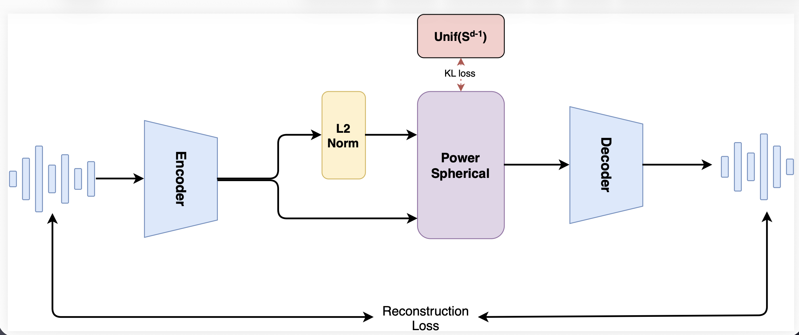

# SphereVAE

SphereVAE: Hyperspherical Latent Autoencoders for Robust Autoregressive Speech Representation Modeling



[arXiv](https://arxiv.org/pdf/2609.09903v1) · [Demo](https://haoyuzhang3.github.io/SphereVAE_Demo/) · [Hugging Face](https://huggingface.co/ASLP-lab/SphereVAE)


## Model

SphereVAE combines a SEANet audio codec with causal Transformers and a
Power-spherical latent space for robust speech representation modeling.

## Installation

Use Python 3.10 or newer. Install a PyTorch and torchaudio pair appropriate for
your machine, then install the dependencies:

```bash
python -m pip install -r requirements.txt
```

GPU training uses Accelerate. Configure it for your machine before launching:

```bash
accelerate config
```

## Training data

Place a Kaldi-style SCP file at `data/train.scp`, or update
`data.train_scp_path` in `configs/config_Sphere_VAE.yaml`:

```text
utt_0001 /path/to/audio_0001.flac
utt_0002 /path/to/audio_0002.wav
```

Each line contains an utterance ID and an audio path. Audio is processed as
mono 24 kHz input and prepared as training segments by the dataset pipeline.

## Training

```bash
CUDA_VISIBLE_DEVICES=0 accelerate launch train.py -c configs/config_Sphere_VAE.yaml
```

Adjust training settings in `configs/config_Sphere_VAE.yaml`. Checkpoints and
TensorBoard logs are written to the configured experiment directory. For
multi-GPU training, configure Accelerate and set the visible devices as needed.

## Inference

```bash
python infer.py \
  --checkpoint exps/Sphere_VAE/G_400000.pth \
  --input data/test \
  --output output/reconstructed \
  --device cuda:0
```

`--input` accepts an audio file or directory. Supported extensions are WAV,
FLAC, MP3, OGG, and M4A. Use `--config` to select another configuration.
Inference uses posterior sampling, so repeated runs can produce different
reconstructions. Output is trimmed to the input length.

## Layout

```text
models/model_Sphere_VAE.py  Sphere_VAE model and builder
modules/                SEANet, Transformer, spherical distribution, utilities
train.py                  Training entrypoint
infer.py                  Audio reconstruction entrypoint
dataset.py              SCP-listed audio dataset
configs/                Sphere_VAE configuration
discriminators/         STFT discriminator
losses/                 Spectral and adversarial losses
utils/                  Configuration, checkpoints, and compilation utilities
```

## Citation

```bibtex
@misc{zhang2026spherevaehypersphericallatentautoencoders,
  title={SphereVAE: Hyperspherical Latent Autoencoders for Robust Autoregressive Speech Representation Modeling},
  author={Haoyu Zhang and Jingbin Hu and Hanke Xie and Qirui Zhan and Wenhao Li and Ziyu Zhang and Xiaming Ren and Yue Li and Xunyu Zhu and Zhipeng Chen and Lei Xie},
  year={2026},
  eprint={2609.09903},
  archivePrefix={arXiv},
  primaryClass={eess.AS},
  url={https://arxiv.org/abs/2609.09903}
}
```

## Acknowledgments

Parts of the code are adapted from Kyutai Mimi and Meta AudioCraft/EnCodec,
as indicated by the original notices retained in the source files. This
export does not assign a new license to that third-party code. The source
checkout did not include the root license files referenced by those notices;
applicable upstream license texts still need to be supplied before release.
